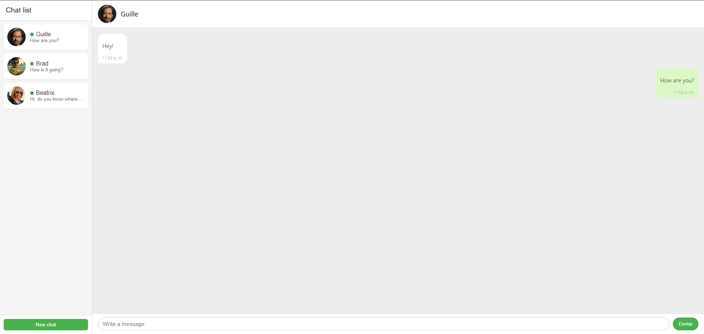
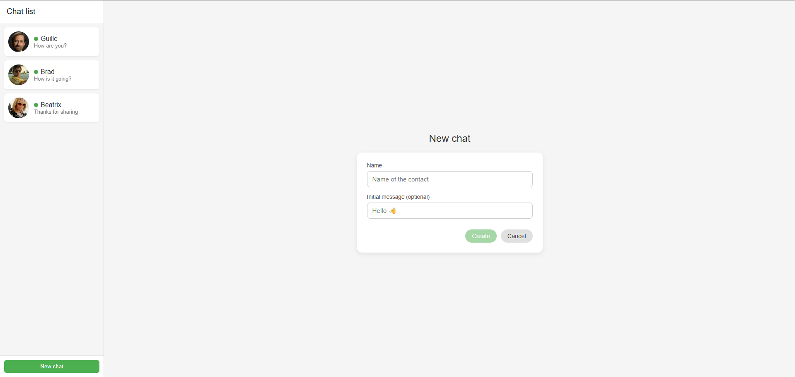
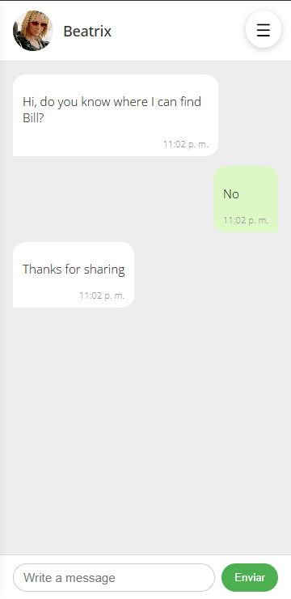
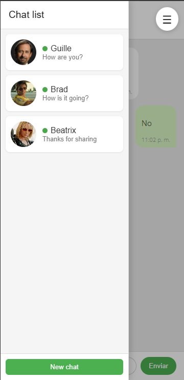

# Clon de Aplicación de Chat en Angular

## Descripción
Este proyecto es un clon funcional de una aplicación de chat, desarrollado con Angular 17 y CSS nativo, como Trabajo Final Integrador del curso.

El objetivo principal fue aplicar los conceptos centrales de Angular moderno, incluyendo Standalone Components, Routing con provideRouter, Control Flow Blocks (@if, @for), Reactive Forms y Signals, además de buenas prácticas de organización y diseño responsive.

La aplicación simula una interfaz de chat con lista de contactos, historial independiente por conversación y envío/recepción automática de mensajes.

## Cómo usar

### Opción A:
Ingresar a https://diplofullstack-tp-final-angular-pdm.vercel.app/

### Opción B:
1. Clonar el repositorio:
   ```bash
   git clone https://github.com/BrunoBoccasile/diplofullstack_tp_final_angular.git
2. Instalar dependencias:
   ```bash
   npm install
3.  Ejecutar el proyecto:
      ```bash 
      ng serve -o


## Funcionalidad

### Panel lateral izquierdo (lista de chats).

- Muestra todos los chats disponibles.
- Permite agregar nuevos contactos mediante un formulario validado (no acepta texto vacío).
- En dispositivos móviles, el panel se abre mediante un botón tipo menú hamburguesa
- Cada contacto incluye:
   - Foto de perfil
   - Nombre
   - Estado (online, offline)
- Uso de Control Flow Blocks de Angular 17:
   - @for para iterar la lista de chats.
   - @if para manejar estados vacíos o condicionales.
- En dispositivos móviles, el panel lateral se oculta y puede desplegarse mediante un menú hamburguesa.

### Panel principal derecho (ventana de chat)
- Muestra el historial de mensajes del chat seleccionado.
- Cada chat mantiene su historial de mensajes de forma independiente.
- Los mensajes se muestran en burbujas diferenciadas:
   - Usuario → alineados a la derecha.
   - App → alineados a la izquierda.
- Al enviar un mensaje:
   - Se muestra inmediatamente en pantalla.
   - La aplicación responde automáticamente con un mensaje simulado luego de un retardo.
- Input de envío implementado con Reactive Forms (FormControl), con validación de texto vacío.
- Scroll automático al último mensaje.

## Routing

- La aplicación utiliza Routing moderno con provideRouter y Standalone Components:
   - /chats → lista de chats.
   - /chats/:id → conversación con un contacto específico.
   - /nuevo → formulario para crear un nuevo chat.
- Manejo de rutas inválidas con redirección.

## Conceptos aplicados

- Standalone Components.
- Routing.
- Control Flow Blocks (@if, @for).
- Reactive Forms (FormGroup, FormControl, validaciones).
- Signals para el manejo del estado global de chats y mensajes.
- Servicios (ChatService) para encapsular la lógica de negocio.
- Interfaces para definir los modelos de datos (Chat, Message).
- Renderizado condicional.
- Manejo de listas dinámicas con track.
- Organización modular del código.

## Estilos y diseño
- Estilos implementados completamente con CSS nativo.
- Uso de Flexbox para:
   - Layout general
   - Lista de chats
   - Alineación de mensajes
- Diseño responsive mediante media queries.
- Burbuja diferenciada para mensajes enviados y recibidos.
- Estética clara (light theme), inspirada en aplicaciones de chat modernas.
- Componentes visuales reutilizables y consistentes.

## Capturas de pantalla






## Créditos
- Autor: Bruno Boccasile
- Curso: Angular
